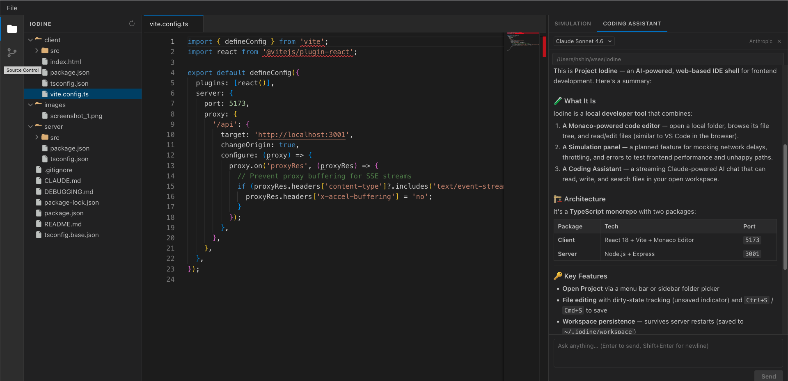
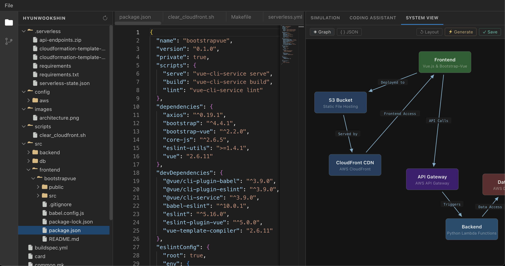

# Project Iodine

## About

**Iodine** is an AI-powered, web-based IDE for frontend performance simulation. It lets developers open a local project, browse and edit files in a VS Code-style interface, and simulate realistic backend conditions — such as slow responses, throttling, and errors — without needing access to a real backend.

A built-in **Coding Assistant**, powered by your choice of AI provider (Anthropic Claude, OpenAI GPT, or Google Gemini), can read, write, and search files in your workspace to help you automate changes like swapping API endpoints, scaffolding loading states, or debugging frontend issues.

## Screenshots





## Features

- 🖥️ **VS Code-like IDE shell** — Activity bar, file explorer sidebar, Monaco-powered code editor, and resizable panels
- 🤖 **AI Coding Assistant** — Streaming chat with tool use (read/write/search files) backed by Claude, GPT, or Gemini
- 🌿 **Source Control panel** — View Git status, stage/unstage files, discard changes, and commit — all from the UI
- 📂 **File preview** — Render `.md` (with GitHub Flavored Markdown) and `.html` files inline
- 🔌 **Simulation panel** — Placeholder for planned network mocking and throttling features
- 💾 **Workspace persistence** — The last opened folder is remembered across server restarts
- 🌐 **System View** — Interactive SVG graph editor for system architecture diagrams. Hit **⚡ Generate** and the AI explores your workspace with file tools, reads key files, and builds a graph from what it actually finds — no prompt needed. Nodes are draggable; pan and zoom with mouse. Stored in `~/.iodine/<workspace-hash>/system-graph.json`.

## Use Cases

* **User experience studies** — Simulate sluggish or unreliable APIs to observe how your UI behaves
* **Frontend optimization** — Profile and improve loading performance under controlled conditions
* **Loading screen development** — Build and tune spinners, skeletons, and progress indicators with realistic delays
* **Error handling / Unhappy paths** — Test 500s, timeouts, and other failure modes without touching the real backend

## How It Works

1. Open a local project folder via **File → Open Project** or the sidebar **Open Folder** button.
2. The AI agent reads your source code and can automatically swap API endpoints to point to `localhost`.
3. A lightweight local Express server mocks delays, throttling, errors, and other backend behaviors.
4. Switch to the **System View** tab and click **⚡ Generate** — the AI reads your actual files and builds an interactive architecture graph.
5. Developers can create **checkpoints** to save and restore the local simulation environment.

## Tech Stack

| Layer | Technology |
|-------|-----------|
| Frontend | React 18, TypeScript, Vite |
| Code editor | Monaco Editor (`@monaco-editor/react`) |
| Markdown preview | `react-markdown` + `remark-gfm` |
| AI providers | Anthropic Claude, OpenAI GPT, Google Gemini |
| Backend | Node.js, Express 4, TypeScript |
| Dev runner | `tsx watch` (server), Vite HMR (client) |
| Monorepo | npm workspaces + `concurrently` |

## Project Structure

```
iodine/
├── package.json              # Root: npm workspaces + concurrently dev script
├── tsconfig.base.json        # Shared TypeScript config
│
├── client/                   # React + TypeScript frontend (Vite) — http://localhost:5173
│   └── src/
│       ├── App.tsx           # Renders WorkbenchLayout
│       ├── providers.ts      # AI provider + model definitions
│       ├── types/            # Shared types: FileNode, OpenFile, UIMessage, etc.
│       ├── api/              # Typed fetch wrappers for file/workspace endpoints
│       ├── hooks/            # useFileTree, useOpenFiles, useGitStatus, useCodingAssistant, …
│       └── components/
│           ├── layout/       # WorkbenchLayout, MenuBar, ActivityBar, Sidebar, EditorArea, RightPanel
│           ├── sidebar/      # FileExplorer, FileTreeNode, SourceControlPanel
│           ├── editor/       # EditorTabs, MonacoEditor, WelcomeScreen
│           └── right/        # SimulationPanel, CodingAssistant, SystemView
│
└── server/                   # Node.js + Express backend — http://localhost:3001
    └── src/
        ├── app.ts            # Express app factory (CORS, JSON, routes)
        ├── state.ts          # Shared mutable state: rootPath (persisted to ~/.iodine/workspace)
        ├── routes/
        │   ├── files.ts      # File system + workspace + git endpoints
        │   └── agent.ts      # POST /api/agent/chat, POST /api/system-graph/generate (SSE), GET /api/agent/status
        └── services/
            ├── fileSystem.ts     # Pure FS operations + path traversal guard
            ├── fileTools.ts      # Shared tool schemas + executeTool() for all agents
            ├── anthropicAgent.ts # Agentic loop using @anthropic-ai/sdk
            ├── openaiAgent.ts    # Agentic loop using openai SDK
            └── geminiAgent.ts    # Agentic loop using @google/genai SDK
```

## Getting Started

### Prerequisites

- Node.js 18+
- npm 9+
- At least one AI provider API key (see [Coding Assistant](#coding-assistant) below)

### Installation & Running

```bash
# Install all dependencies (client + server)
npm install

# Start both client and server in development mode
npm run dev
```

- **Client** (React + Vite): http://localhost:5173
- **Server** (Express): http://localhost:3001

Once running, open a project via **File → Open Project** in the menu bar or click **Open Folder** in the left sidebar.

### Other Scripts

```bash
npm run build      # Build both client and server for production
npm run typecheck  # Run TypeScript type checks across the monorepo
```

## Coding Assistant

The Coding Assistant (right panel) supports three AI providers. Select a provider and model from the dropdowns, then chat naturally. The AI can read, write, and search files in your workspace autonomously.

### Supported Providers & API Keys

| Provider | API Key Location | Models |
|----------|-----------------|--------|
| **Anthropic** | `~/.anthropic/api_key` or `ANTHROPIC_API_KEY` env var | Claude Sonnet 4.6 / 4.5 / 3.7 |
| **OpenAI** | `OPENAI_TOKEN` env var | GPT-4o, GPT-4o mini, o3, o4-mini |
| **Google** | `GEMINI_API_KEY` env var | Gemini 2.5 Flash / Pro, 2.0 Flash |

> If Claude Code is installed, its Anthropic key is reused automatically.

The UI shows a warning banner when the selected provider's key is not configured. Click **?** in the panel header for setup instructions.

### AI File Tools

All three providers share the same tool layer and can perform:

| Tool | Description |
|------|-------------|
| `read_file` | Read a file from the workspace |
| `write_file` | Write (or create) a file in the workspace |
| `list_directory` | Browse the directory tree (depth 3) |
| `search_files` | Grep-like text search across workspace files |

## API Reference

| Method | Path | Description |
|--------|------|-------------|
| `GET` | `/api/health` | Health check |
| `POST` | `/api/workspace/open` | Set workspace root `{ path }` |
| `GET` | `/api/workspace` | Get current workspace root |
| `POST` | `/api/workspace/find` | Search for a directory by name `{ name }` |
| `GET` | `/api/files/tree` | Full directory tree from workspace root |
| `GET` | `/api/files/content?path=` | Read a file's text content |
| `PUT` | `/api/files/content` | Write a file `{ path, content }` |
| `GET` | `/api/git/status` | Git status badges for the file tree |
| `GET` | `/api/git/diff?path=` | Unified diff for editor decorations |
| `GET` | `/api/git/changes` | Full staged/unstaged change list for SCM panel |
| `POST` | `/api/git/stage` | Stage a file `{ relPath }` |
| `POST` | `/api/git/unstage` | Unstage a file `{ relPath }` |
| `POST` | `/api/git/stage-all` | Stage all changes |
| `POST` | `/api/git/discard` | Discard changes `{ relPath, isUntracked }` |
| `POST` | `/api/git/commit` | Commit staged changes `{ message }` |
| `GET` | `/api/agent/status` | Per-provider API key status |
| `POST` | `/api/agent/chat` | SSE stream: AI chat with tool use |
| `GET` | `/api/system-graph` | Load saved architecture graph for current workspace |
| `PUT` | `/api/system-graph` | Save architecture graph for current workspace |
| `POST` | `/api/system-graph/generate` | SSE stream: agentic graph generation (reads workspace) |

## What Do You Plan to Support?

* HTTP/HTTPS endpoint mocking
* gRPC mocking
* LLM API simulation
* Checkpoint save/load for simulation environments
